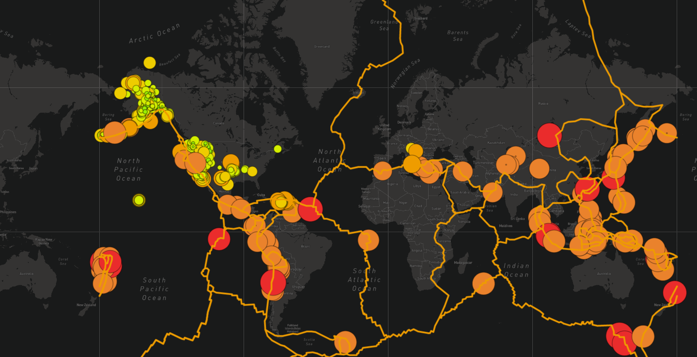

## **PROJECT OVERVIEW**

This project is about making interactive maps of earthquakes of past 7 days using Leaflet.js Application Programming Interface (API) to populate a geographical map with GeoJSON earthquake data from a URL. Each earthquake is visually represented by a circle and color, where a higher magnitude has a larger diameter and is darker in color. In addition, each earthquake has a popup marker that, when clicked, show the magnitude of the earthquake and the location of the earthquake.

There are 3 types of maps and show two types of earthquake data and lines of Tectonic plates. 

